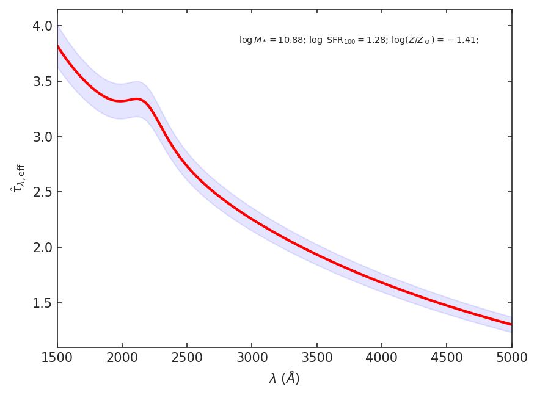

# DustE
Calculate dust attenuation curves for various configurations of physical properties of galaxies like stellar mass, star formation rates, and metallicities. This code is designed with theorists in mind: by supplying lists of non-dust properties as mentioned above, they can get state-of-the-art estimates for the dust properties of their simulated galaxies. Of course, observers can also compare their findings to our models, which will be a useful validation process. 

## Background
We created hierarchical/population Bayesian models for dust attenuation, which are described in Nagaraj+22a (submitted). Using Prospector spectral energy distribution (SED) fitting posterior samples for nearly 30,000 galaxies in a mass-complete 3D-HST (http://3dhst.research.yale.edu/Home.html) sample ([Leja et al. 2017](https://ui.adsabs.harvard.edu/abs/2017ApJ...837..170L/abstract), [2019](https://ui.adsabs.harvard.edu/abs/2019ApJ...877..140L/abstract), [2020](https://ui.adsabs.harvard.edu/abs/2020ApJ...893..111L/abstract)), we fit a linear interpolation function in five dimensions in order to determine how the dust attenuation curve varies over physical properties like stellar mass and star formation rate. As a result, we have created four models that are available for the user. We have both two-component (diffuse and birth cloud) and single-component (effective) dust attenuation model options. In the case of the two-component models, the birth cloud dust optical depth is modeled as a 1-D interpolation function of diffuse dust optical depth, which we provide in the form of a convenience function get_d1 (method of the DustAttnCalc class, see below). For diffuse dust and effective dust, we have a model that predicts both the dust optical depth and slope of the attenuation curve as well as a model that requires dust optical depth as an input to calculate the slope of the attenuation curve. The model of choice can be chosen through Boolean options for the DustAttnCalc class instance

The two-component model, inspired by the great success of the [Charlot & Fall (2000)](https://ui.adsabs.harvard.edu/abs/2000ApJ...539..718C/abstract) model in describing real galaxies, is used by Prospector in SED fitting. The model considers that the light from stars passes through either one or two dust screens in front of the galaxy. Light from stars under 10 Myr old pass through both screens (diffuse and birth cloud dust) whereas light from all other stars pass through only the diffuse dust screen. The birth cloud dust attenuation curve is treated as a simple inverse law with the normalization optical depth at 550 nm. The diffuse dust attenuation curve is parameterized in the form used by [Noll et al. (2009)](https://ui.adsabs.harvard.edu/abs/2009A%26A...507.1793N/abstract) and [Kriek & Conroy (2013)](https://ui.adsabs.harvard.edu/abs/2013ApJ...775L..16K/abstract), which is a flexible generalization of the [Calzetti et al. (2000)](https://ui.adsabs.harvard.edu/abs/2000ApJ...533..682C/abstract) curve. We use this same parameterization for the effective dust curve as well. For the effective dust attenuation case, there is simply one dust screen that affects all stars regardless of age.
## Installation
To install the package, simply type the following command in terminal.

        pip install DustE

Alternately (not as recommended), open terminal in the directory where you would like the code to be placed and type
        
        git clone https://github.com/Astropianist/DustE.git

### Dependencies
A few packages that are available through pip and/or Anaconda are required to run the code. **The pip install command above should take care of all of the dependencies, so no extra work is needed.**

* NumPy (tested on 1.20.0)
* SciPy (tested on 1.6.0)
* ArViz (tested on 0.11.2)
* Matplotlib (tested on 3.4.2)
* Seaborn (tested on 0.11.1)
* Astropy (tested on 4.2)
* [Sedpy](https://github.com/bd-j/sedpy)
* [Dynesty](https://dynesty.readthedocs.io)

## Using the code
The main functionality of the code comes from the DustAttnCalc class of DustAttnCalc.py. It can be used to calculate and plot dust attenuation curves depending on values of the independent parameters (log stellar mass, log star formation rate, log stellar metallicity, redshift, axis ratio, or even the dust optical depth)
. 

We will now present a few examples to show how the code works. **We assume that DustE is installed through pip. However, the command-line mode (python DustAttnCalc.py) versions can only be done in the subdirectory where DustAttnCalc.py is located.**

### Example 1: Calculate dust attenuation parameters for an individual galaxy

Type the following prompt into a terminal (adjust values and add or remove independent variables as necessary). Once again, for this particular example, you must be in the subdirectory where DustAttnCalc.py is located. In this case, we provide stellar mass, SFR, and redshift and ask for the bivariate two-component dust model. The code marginalizes over stellar metallicity and axis ratio.

        python DustAttnCalc.py -logM 10.5 -sfr 1.0 -z 1.5 -bv

The result is the following (ignoring extra print statements).

        n, tau_2, tau_1: 0.034 +/- 0.042, 0.789 +/- 0.053, 0.793 +/- 0.055
        n vs tau Average Correlation Coefficient rho: 0.310

Note that this can be done in a script or interactive Python window. In subsequent examples, we show possibilities for such scripts.

### Example 2: Calculate birth cloud dust optical depth from diffuse dust optical depth

#### Technique 1: Command-line, file

Place the diffuse dust optical depths into a single-column ascii file with header "d2." We use the sample file Sample_f2.dat (provided). Type the following command into a terminal (and adjust file name as necessary). Just to reiterate, to be able to use command-line mode, you must be in the same subdirectory as DustAttnCalc.py.

        python DustAttnCalc.py -f2 Sample_f2.dat

The result will be the following (ignoring other print statements), corresponding to the eight optical depths in the file:

        Dust1 average values: [0.39312231 0.79425555 0.18963501 0.3586911 1.59415881 2.18774406 2.188264 2.16303121]
        Dust1 Standard deviations: [0.06190268 0.08047815 0.04678386 0.05974306 0.11096629 0.03208986 0.03214327 0.04680665]

#### Technique 2: Interactive Python or script, arrays

Open up an interactive Python window or write the following lines in a script (any directory).

        from duste.DustAttnCalc import DustAttnCalc
        import numpy as np
        
        d2 = np.linspace(0.1,2.0,10)
        dobj = DustAttnCalc()
        d1sim, _ = dobj.get_d1(d2)
        d1, d1e = np.average(d1sim, axis=0), np.std(d1sim, axis=0)
        print("d1 values:", d1)
        print("d1e values:", d1e)

The result of the print statements, once again, is arrays for birth cloud dust optical depth mean and standard deviation.

        Dust1 average values: [0.11958332 0.29070451 0.50251462 0.73115189 0.98102995 1.25353043 1.57401674 1.86923729 2.12308391 2.18606005]
        Dust1 Standard deviations: [0.05584508 0.06165037 0.06452066 0.06476246 0.08689269 0.08440908 0.1118049  0.10828458 0.06871685 0.03173608]

### Example 3: Calculate (and plot) dust attenuation curves for multiple galaxies

#### Technique 1: Command-line, file

Place values of independent variables in an ascii file. The possible headers are "logM" (log stellar mass), "sfr" (log SFR), "logZ" (log stellar metallicity in terms of solar), "z" (redshift), "i" (axis ratio b/a), "d2" (diffuse dust optical depth), and "de" (effective dust optical depth). The final two options can be used with the univariate model, in which the optical depth is used to help calculate the attenuation slope. **Note that with the command-line option you can make plots and see the attenuation parameter values but will not have direct access to all created arrays.**

We provide Sample_f1.dat as an example for an independent variable file (located in DustE/src/duste). Type the following line into command line (adjust as necessary for file name). 

        python DustAttnCalc.py -f1 Sample_f1.dat -bv -inb sample_f1 -mnp 2

The result of this command is the text shown below as well as two dust attenuation curve plots sample_f1_00.png and sample_f1_01.png stored in DustAttnCurves/. The two galaxies are randomly chosen from the galaxies in Sample_f1.dat. We discuss plots further and show an example with the second technique.

        n: [-0.01448396 -0.02445773 -0.08416219 -0.16112971 -0.14947119]
        n error: [0.04381379 0.03916229 0.04458178 0.04609532 0.03906517]
        tau: [1.12040977 0.35787803 0.80088594 0.49005854 0.47413243]
        tau error: [0.05402635 0.03848954 0.05236735 0.04381667 0.04813823]
        tau1: [1.19851961 0.34892385 0.81187079 0.48468084 0.4719089 ]
        tau1 error: [0.07402834 0.04198751 0.05953972 0.04390203 0.04619509]
        n vs tau Average Correlation Coefficient rho: 0.310

#### Technique 2: Script/Interactive Python window, arrays

Type the following into a script or interactive Python window (any directory).

        from duste.DustAttnCalc import DustAttnCalc
        import numpy as np
        
        ngal = 100 # Number of galaxies to use
        # Set stellar mass, star formation rate, and metallicity within the bounds suggested in the code
        logM = np.random.uniform(8.74,11.30,ngal)
        sfr = np.random.uniform(-2.06,2.11,ngal)
        logZ = np.random.uniform(-1.70,0.18,ngal)
        dust_attn = DustAttnCalc(logM=logM, sfr=sfr, logZ=logZ, bv=1, eff=0) # Two-component bivariate dust model (fitting both optical depth and slope) 
        dac, dac1, n, tau, tau1, n_err, tau_err, tau1_err = dust_attn.calcDust(plot_tau=True, max_num_plot=5) 
        
The last line of the snippet above will calculate samples for the diffuse and birth cloud dust attenuation curves for all 100 galaxies created earlier. For convenience, it will also provide averages and standard deviations for the attenuation parameters. It will also produce 5 dust attenuation plots showing both diffuse and birth cloud dust (from the argument plot_tau1=True). The 5 points will be selected randomly from the 100 galaxies created earlier. By default, the images will be stored in a directory called DustAttnCurves and named DustAttnCurve_bv_1_eff_0_0i, with i ranging from 0 to 4. Here is an example of the type of image that would be produced from the code above.

  

### Example 3.1: Calculate (and plot) effective dust attenuation curves for multiple galaxies

We will closely follow the previous example's technique 2 and explore the effective dust attenuation curve. In all of the examples so far, we have calculated both diffuse and birth cloud dust attenuation curves. However, if you do not have any information about the specifically younger constituents in a host galaxy, it may be simpler to use the single screen model. 

        from duste.DustAttnCalc import DustAttnCalc
        import numpy as np
        
        ngal = 100 # Number of galaxies to use
        # Set stellar mass, star formation rate, and metallicity within the bounds suggested in the code
        logM = np.random.uniform(8.74,11.30,ngal)
        sfr = np.random.uniform(-2.06,2.11,ngal)
        logZ = np.random.uniform(-1.70,0.18,ngal)
        dust_attn = DustAttnCalc(logM=logM, sfr=sfr, logZ=logZ, bv=1, eff=1) # Two-component bivariate dust model (fitting both optical depth and slope) 
        dac, _, n, tau, _, n_err, tau_err, _ = dust_attn.calcDust(plot_tau=True, max_num_plot=5)
        
Notice that the source code is nearly identical to the previous example. In this case, though, we change "eff=0" to "eff=1" when creating the attenuation curve. The only difference is that dac1, tau1, and tau1_err (outputs of calcDust) are None, so we can disregard them. Similarly, dac, n, tau, n_err, and tau_err refer to the parameters of the effective dust screen rather than diffuse dust. The plot below is an example of the type of image that would be produced from the code above.

  

